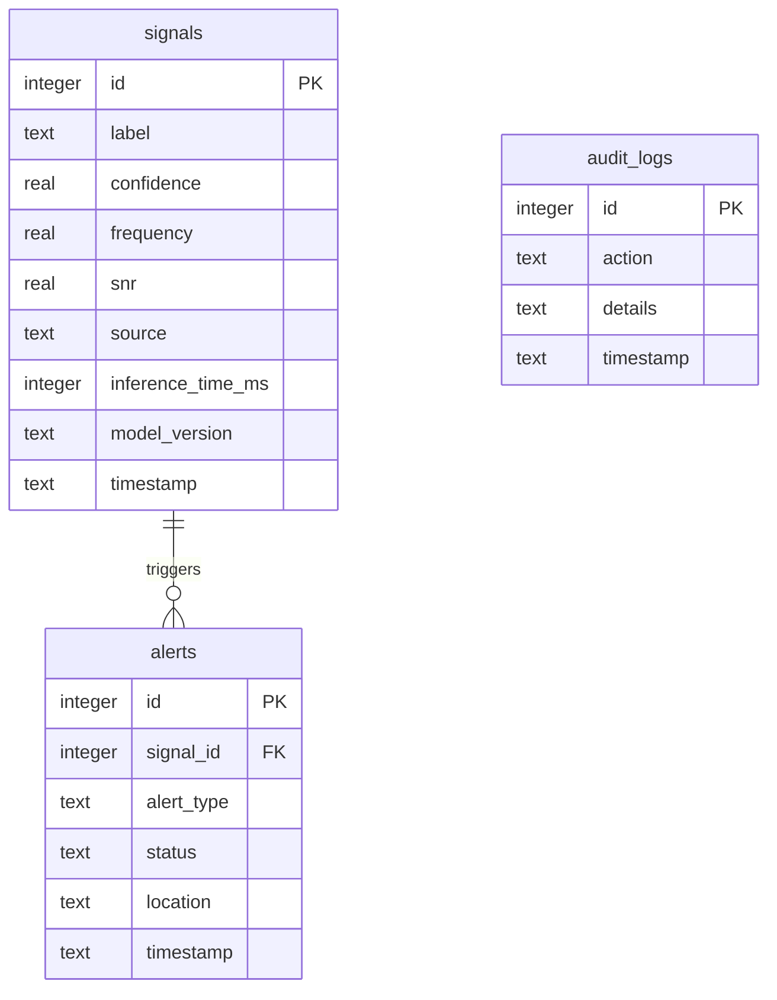

# SADAR Database ER Diagram

```mermaid
erDiagram
    signals ||--o{ alerts : triggers
    signals {
        integer id PK
        text label
        real confidence
        real frequency
        real snr
        text source
        integer inference_time_ms
        text model_version
        text timestamp
    }
    alerts {
        integer id PK
        integer signal_id FK
        text alert_type
        text status
        text location
        text timestamp
    }
    audit_logs {
        integer id PK
        text action
        text details
        text timestamp
    }
```
